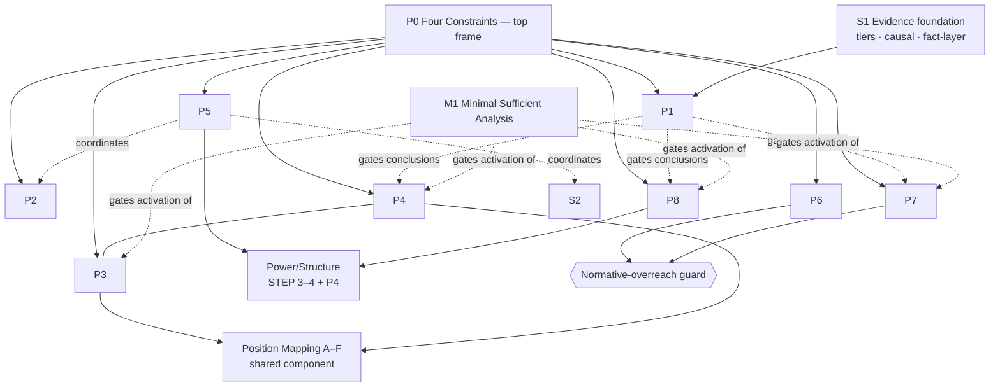

# Architecture Audit (v0.2.6)

A systematic audit of the whole skill — `SKILL.md`, references, failure
modes, self-checks, benchmark structure — after promoting Class/Position
Power to a first-class principle. **This audit is the round's main task; it
is not a rule-adding contest.** Where a problem could be fixed by wording,
trigger, or hierarchy, that was preferred over a new principle.

## 1. First-class principle inventory

| # | Principle / module | Kind |
|---|---|---|
| P0 | Four constraints (female-first · high evidence · anti-false-equivalence · no correct life) | top frame |
| P1 | Null Result Principle | conclusion gate |
| P2 | Responsibility Principle | axis separation |
| P3 | Intersectionality Invocation (+ Position mapping A–F) | differentiation |
| P4 | **Class / Position Power Principle** (new this round) | power axiom |
| P5 | Parallel Analysis (Agency ∥ Power/Structure) | coordination |
| P6 | Anti-"correct life" defense | normative guard |
| P7 | Baseline Interrogation | triggered probe |
| P8 | Comparison discipline / Anti-false-equivalence | triggered probe |
| S1 | Evidence tiers + Causal-inference + STEP 1 fact-layer | evidence foundation |
| S2 | Agency framework (9-concept ladder) | vocabulary |
| S3 | STEP 1–11 analysis model | procedure |
| M1 | Minimal Sufficient Analysis (meta-rule, new-explicit this round) | activation governor |

## 2. Principle dependency graph

**Reading.** P0 frames everything. S1 (evidence) feeds P1 (Null Result),
which then **gates** the conclusion strength of the triggered probes (P4/P7/
P8). P5 coordinates the agency vocabulary (S2), the power axis, and P2. P3
and P4 **share** the Position Mapping component (drawn as a shared node, not
a mutual dependency). M1 gates *whether* the optional modules activate.

**Cycle check:** No directed cycles. The one bidirectional-looking link
(P3 — P4) is a **shared component** (Position Mapping), not a circular
dependency: both invoke the same A–F step; neither is defined in terms of the
other. Confirmed acyclic.

## 3. Trigger hierarchy

| Layer | Modules | Always-on? |
|---|---|---|
| **0 Frame** | P0, S1, M1 | Always active (frame + evidence + activation governor) |
| **1 Core-on-analysis** | P5 (agency ∥ structure), P2 (responsibility) | On whenever a gendered situation is analyzed |
| **2 Conditional** | P3/P4 (intersectionality / position power) | Trigger: a differentiating axis (class, position, migration, race, age…) is materially in play |
| **2 Conditional** | P7 (baseline interrogation) | Trigger: ranking/progress language (向上/向下, 堕落, 更独立…) |
| **2 Conditional** | P8 (comparison discipline) | Trigger: another group/gender introduced |
| **2 Conditional** | P6 (anti-correct-life) | Trigger: a woman's lifestyle choice is being evaluated |
| **1 Gate** | P1 (null result) | Applies at conclusion time to *whatever* ran |

**Execution when several fire at once:** they run **in parallel on their own
axis**, then converge at the conclusion, which is gated by P1 + S1. There is
no fixed sequential pipeline (that would be checklist behaviour). M1 keeps
untriggered layer-2 modules **off**.

## 4. Conflict resolution (explicit, no implicit priority)

For each tension: **who defines perspective · who limits the conclusion ·
who supplies evidence · who makes the final judgment.**

| Tension | Defines perspective | Limits conclusion | Supplies evidence | Final judgment |
|---|---|---|---|---|
| **Female-first ↔ Null Result** | Female-first (picks primary subject) | Null Result (forbids forced oppression verdict) | S1 evidence tiers | Evidence-bound; female-first never forces the verdict |
| **Agency ↔ Power/Structure** | Parallel Analysis (both, parallel) | each caps the other (constraint≠no-agency; choice≠freedom) | option set · exit capacity · resources | Dual reading; neither inferred from the other |
| **Structural explanation ↔ Responsibility** | — (both axes) | Responsibility Principle (keeps them separate) | STEP 7 attribution · STEP 5 agency | Both full at once; explanation≠exemption |
| **Intersectionality ↔ Gender analysis** | Female-first (gender stays the subject) | Intersectionality ("does not erase gender") | Position mapping per axis | Gender retained as a dimension, specified by position |
| **Comparison ↔ Female-first** | Female-first (who is primary subject) | Comparison discipline (admits evidence, blocks derailment) | Comparison Relevance Test | Different layers: subject-selection vs evidence-admission — no conflict |
| **Class/Position ↔ Gender structure** | Female-first | Class/Position (neither erases the other) | Position power mapping | **Empirical** — which axis governs *this* relation is decided by evidence |

**The one intended, now-explicit priority:** S1 (evidence) + P1 (Null Result)
sit **above** stance in every row — female-first can define *perspective* but
can never *override evidence* to force a conclusion. This was previously
implicit; the table makes it explicit. No *other* hidden priorities found.

## 5. Minimal Sufficient Analysis — validated

The meta-rule (M1) now states explicitly: *do not invoke more machinery than
the case requires; modules activate by relevance/trigger; an untriggered
module must not hunt for material to justify itself; thin evidence → null
result is a valid stop.* Validation: in the framing-order run (v0.2.5) and the
stress run below, no case ran all modules; each activated 2–4 relevant ones.
DF/NR spot-checks confirm P3/P4/P8 stay dormant when no differentiating axis
or comparison is present.

## 6. Graceful non-activation — checked

- **Irrelevant modules stay inactive?** Yes — trigger-gated (§3). E.g. a
  single-subject lifestyle question does not fire P4 (no position relation)
  or P8 (no comparison).
- **No-op / null result allowed when evidence is thin?** Yes — P1 + M1
  explicitly permit stopping at "insufficient evidence."
- **Do untriggered modules self-justify?** No — M1 forbids a module from
  seeking material to trigger itself. This is the key anti-checklist rule.

## 7. Architecture matrix (all first-class principles)

| Principle | Trigger | Primary function | Can constrain | Cannot override | Typical failure if overused |
|---|---|---|---|---|---|
| **P0 Four constraints** | always | Frame the whole analysis | all modules | evidence (S1) | rigid ideological output |
| **P1 Null Result** | at conclusion | Prevent forced oppression verdict | P4/P7/P8 conclusions | a genuinely evidence-backed strong claim | under-claiming; false "indeterminate" when evidence is clear |
| **P2 Responsibility** | responsibility in play | Separate explanation from blame | responsibility calls | structural explanation (must still be given) | moralizing; over-blame |
| **P3 Intersectionality** | differentiating axis present | Prevent homogenizing "women" | power reading | gender (must not erase it) | checklist of identities; sympathy-only add |
| **P4 Class/Position** | class/position materially in play | Multidimensional, empirical power reading | gender-only reading | gender structure (neither erases the other) | class-as-master; ignoring gender |
| **P5 Parallel Analysis** | any gendered analysis | Hold agency & structure parallel | ordering of the two axes | neither axis over the other | mechanical dual-boilerplate |
| **P6 Anti-correct-life** | lifestyle choice judged | Block new "correct woman" norms | normative verdicts | legitimate aggregate structural critique | relativism; refusing all critique |
| **P7 Baseline Interrogation** | ranking/progress language | Surface hidden baseline | "downward/regressive" verdicts | an evidence-backed autonomy-reduction finding | over-interrogation of trivial wording |
| **P8 Comparison discipline** | other group introduced | Classify comparison by function | false-equivalence & derailment | admissible cross-group evidence | over-labeling comparison as derailment |
| **M1 Minimal Sufficient** | always | Govern activation | module invocation | a genuinely needed module | under-analysis |

## 8. Ten architecture-risk checks

1. **Recursive reasoning** — none. No principle invokes itself; shared
   Position Mapping is a leaf component (§2).
2. **Hidden priority hierarchy** — one existed implicitly (evidence/Null
   Result above stance); now **explicit** (§4). No others.
3. **Checklist explosion** — the real standing risk given 9 principles + 11
   STEPs. Mitigated by M1 + trigger-gating (§3, §5). Status: controlled,
   must stay guarded in future edits.
4. **Duplicate rules** — **one finding:** the "benefits from patriarchy → no
   constraint" reverse-collapse ban appears in P2 (Responsibility), P4
   (Class/Position), and the anti-flattening rule. Mildly redundant. See §10.
5. **Contradictory wording** — **one finding, fixed this round:** corrected
   axiom #1 said "*structure first*," which contradicted P5 (no axis first).
   Reworded to "examine structure as a matter of course, in parallel with
   agency." Resolved by clarification, not a new rule.
6. **One principle silently overriding another** — none silent; §4 makes the
   evidence/Null-Result gate explicit.
7. **Reference dependency that should be core** — Class/Position **was** the
   case; promoted this round. No others outstanding.
8. **Core rule that should be reference-level** — none. Core holds
   procedures (Q-lists) and axioms; examples already live in references.
9. **Unnecessary invocation** — governed by M1; validated in §5–6.
10. **Evidence/interpretation confusion** — handled by STEP 1 fact-layer +
    evidence tiers; no confusion found.

## 9. Architecture stress-case results (AS-01…06)

Run under the v0.2.6 engine; scored on `scorecard.md` (16). AS-01 and AS-03
require the same subject to be subordinate on one axis **and** dominant on
another simultaneously.

| Case | Configuration | Dual position? | Total | Note |
|---|---|---|---|---|
| AS-01 | female + wealthy + employer | **yes** | 16/16 | class/position dominant over staff ∥ possible gender subordination among peers — both held, empirically split |
| AS-02 | female + subordinate employee | no | 15/16 | class/position correctly named as the governing axis; gendered labor-market placement kept |
| AS-03 | female + institutional authority | **yes** | 16/16 | institutional power over subjects ∥ gendered promotion ceiling — both held; empowerment≠liberation applied |
| AS-04 | female + immigrant / class disadvantage | no | 15/16 | gender+migration+class stacking; employer asymmetry named; agency preserved |
| AS-05 | female + privileged social position | no | 15/16 | non-gender-axis advantages named ∥ specific gendered treatment assessed by evidence; not generalized to all women |
| AS-06 | male/female with unequal positional power | no | 15/16 | position/class axis (woman dominant) governs; refused both "man-oppresses-woman" and "low-status-man-is-real-victim" single-axis collapses; female-first kept without presuming she is the weaker party |

**All six pass.** The dual-position cases (AS-01, AS-03) are the showcase: the
subject is held as **subordinate on one axis and dominant on another at the
same time**, with the governing axis chosen by evidence — exactly what P4 was
promoted to make first-class. No case collapsed to a single master axis
(failure mode #29 did not fire).

## 10. Findings & recommendations

**F. Cycles / conflicts / hidden priority.** No cycles. The one hidden
priority (evidence/Null-Result above stance) is now explicit (§4). The one
wording contradiction (structure-first vs parallel) is fixed (§8.5).

**G. Rules that should be demoted to reference.** None. Core currently holds
only axioms + short procedures; all example/theory material already lives in
references. Demoting further would hollow the engine.

**H. Rules that should be promoted to core.** None outstanding — Class/Position
was the last reference-level rule doing core-level work, and it is promoted
this round.

**I. Duplicate / mergeable rules.** One mild redundancy (§8.4): the
reverse-collapse ban is stated in P2, P4, and anti-flattening. Recommendation
— **do not merge now** (each site reads naturally in context and the
repetition aids reliability). Flag for a future *clarify-only* pass:
designate P4 as the canonical statement and have P2/anti-flattening
cross-reference it. Low priority; not worth a variable this round.

**J. Principle-complete / architecture-tuning stage?** **Yes.** Evidence:
(a) v0.2.4 and v0.2.5 showed diminishing per-dimension returns; (b) this
audit found **no missing principle** — the last gap (Class/Position) was a
*promotion*, not a new idea; (c) remaining issues are wording/redundancy/
trigger-tuning, not absent axioms. The skill has reached
**principle-completeness for its stated scope**; further work is **tuning**,
not expansion.

**K. Next-stage recommendation.** Stop adding/promoting principles. Move to a
**tuning + validation** phase:
1. **Trigger calibration** — empirically check activation rates (does P7 fire
   on trivial wording? does P8 over-trigger?) against the benchmark.
2. **Consolidation clarify-pass** — the single reverse-collapse-ban
   cross-reference cleanup (§8.4); no behaviour change.
3. **Benchmark coverage** — extend framing-order/stress tests to non-choice
   domains (harassment, violence, health) to confirm parallelism holds
   outside lifestyle cases.
4. Only *after* tuning stabilizes: consider v0.3 automated evaluation (out of
   scope now).
